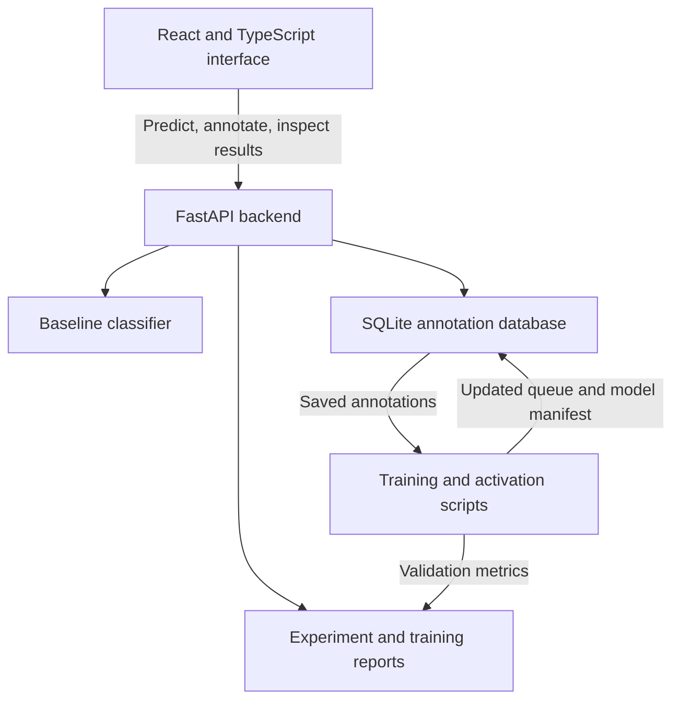

# Support Learning Lab

A full-stack machine learning project exploring how human feedback and active learning can improve support intent classification.

Built with Python, scikit-learn, FastAPI, SQLite, React and TypeScript.

## Motivation

Customer support messages often describe similar problems with different underlying intentions. A missing transfer, a declined payment and an unexpected refund require different responses, even when their wording overlaps.

Training a classifier requires labeled examples. But labeling every message takes time, and adding more labels does not automatically guarantee a better model.

This project investigates a practical question:

> When the labeling budget is limited, which examples should we label next?

Support Learning Lab combines reproducible experiments with an interactive annotation workflow. It connects model evaluation, human decisions, persistent storage and model activation in one application.

## What the application does

- Classifies English banking support messages and displays the three highest-scoring categories.
- Compares random sampling with uncertainty-based sampling.
- Visualizes learning curves across multiple random seeds.
- Presents uncertain messages for manual annotation.
- Stores annotations in a local SQLite database.
- Retrains an annotation model using the initial examples and saved annotations.
- Evaluates the candidate model on a fixed validation set.
- Activates a selected candidate and refreshes the annotation queue.
- Displays the active model version and its training results.

The project currently runs locally. It is a research and engineering prototype.

## Architecture



There are two separate model roles:

| Model | Purpose |
| --- | --- |
| Baseline classifier | Serves the main text classification endpoint |
| Annotation model | Produces suggestions and uncertainty scores for the annotation queue |

Activating an annotation model updates the queue. It does not replace the baseline used by the main classifier.

## Dataset and evaluation

The project uses [BANKING77](https://github.com/PolyAI-LDN/task-specific-datasets/tree/master/banking_data), a dataset of English banking support queries covering 77 intent categories.

| Partition | Examples | Purpose |
| --- | ---: | --- |
| Training portion | 8,002 | Model fitting and active learning pool |
| Validation portion | 2,001 | Experiment comparison and candidate evaluation |
| Official test set | 3,080 | Reserved for final evaluation of the active learning workflow |

The original training CSV contains 10,003 examples. It is split using a stratified 80/20 split with `random_state=42`.

The active learning results below are validation results. They are not official test-set results.

### Evaluation metric

The main experiment metric is macro-F1: F1 is calculated separately for each category and then averaged.

This gives every intent equal weight, making performance across all 77 categories visible.

## Classification approach

The models use a scikit-learn pipeline:

1. TF-IDF text features with word unigrams and bigrams.
2. Logistic regression for intent classification.

The balanced experiments and annotation models use `class_weight="balanced"`.

TF-IDF is fitted on the currently labeled training examples in each round. Validation examples are excluded from feature fitting and classifier training.

A lightweight model makes repeated experiments practical on a laptop and provides a clear baseline for future comparisons.

Displayed model scores are uncalibrated. They should not be interpreted as guaranteed probabilities of correctness.

## Active learning experiments

Two strategies are compared under the same labeling budget:

| Strategy | Selection rule |
| --- | --- |
| Random sampling | Select examples randomly from the remaining pool |
| Margin sampling | Select examples with the smallest gap between the two highest model scores |

For margin sampling, uncertainty is measured as:

`margin = highest score − second-highest score`

A small margin means the model has difficulty choosing between its two leading categories.

### Experimental protocol

- Random seeds: `7`, `21`, `42`.
- Initial labeled set: 5 examples per category, totaling 385.
- Additional budget: 100 examples per round.
- Selection rounds: 5.
- Final labeled set: 885 examples.
- The two strategies start from the same initial set within each seed.
- Both strategies use the same fixed validation set.
- The model is retrained after each selection round.
- In the simulation, dataset labels become available to training only after their examples are selected.

### Results with balanced class weights

Mean validation macro-F1 across three seeds. The value after `±` is the standard deviation across seeds.

| Labeled examples | Random sampling | Margin sampling |
| ---: | ---: | ---: |
| 385 | 0.503 ± 0.013 | 0.503 ± 0.013 |
| 485 | 0.541 ± 0.009 | 0.544 ± 0.013 |
| 585 | 0.566 ± 0.020 | 0.570 ± 0.016 |
| 685 | 0.586 ± 0.020 | 0.603 ± 0.016 |
| 785 | 0.608 ± 0.020 | 0.630 ± 0.009 |
| 885 | 0.629 ± 0.010 | 0.661 ± 0.012 |

At 885 labeled examples, margin sampling achieved approximately 3.2 F1 percentage points more than random sampling.

This is an exploratory result from three seeds on one validation split. It does not establish statistical significance or quantify how many annotations could be saved in another setting.

### Why class weighting matters

Early experiments without class weighting showed a performance drop after adding the first batch of examples.

The selected batches changed the distribution of labels. Follow-up diagnostics examined class counts and compared weighted and unweighted training.

The balanced experiments improved the learning curves. Both selection strategies use the same weighting, so the comparison does not give one strategy a different classifier configuration.

The dashboard includes both experiment variants to make this modeling choice visible.

## Human-in-the-loop workflow

The annotation workflow turns the experiment into an interactive application.

1. Prepare an initial balanced model using 385 labeled examples.
2. Score the remaining 7,617 training-pool messages.
3. Present unannotated messages in ascending margin order.
4. Save the selected category in SQLite.
5. Train a candidate model using the initial examples and saved annotations.
6. Compare the candidate with the current annotation model on the fixed validation set.
7. Activate the candidate while the backend is stopped.
8. Recompute suggestions and reorder the remaining queue.

Training and activation are separate operations. Training saves a candidate without immediately changing the active queue.

### Persistence and validation

The annotation API:

- Accepts only categories from the dataset's category list.
- Checks that the requested sample exists.
- Rejects duplicate annotations.
- Stores one annotation per sample.
- Uses parameterized SQL statements.
- Reports completed and remaining queue counts.

Original sample identifiers are retained so the training workflow can check that annotations belong to the training portion and do not overlap with the validation set.

### Model activation

The activation script checks that the candidate matches the current manifest and saved annotations.

Before updating the queue, it backs up the database and manifest. A recovery marker supports restoring an interrupted activation when the script is run again.

Activation requires the backend to be stopped. The current workflow is intended for local use, without concurrent annotation writes.

## Demonstration training run

The current demonstration adds 10 annotations to the initial 385 examples.

| Metric | Result |
| --- | ---: |
| Training examples | 395 |
| Added annotations | 10 |
| Validation examples | 2,001 |
| Macro-F1 before training, rounded | 0.5083 |
| Macro-F1 after training, rounded | 0.5111 |
| Change, calculated from unrounded values | +0.27 F1 percentage points |

The labels in this demonstration were assigned with assistant guidance. One ambiguous example was resolved using the dataset reference label.

This run demonstrates the annotation, retraining and activation workflow. It is not an independent human annotation study.

An earlier run with randomly chosen interface-test labels is excluded from these results.

## Repository overview

| File or directory | Responsibility |
| --- | --- |
| `api.py` | Main API, baseline predictions and experiment results |
| `annotation_api.py` | Queue retrieval and annotation storage |
| `annotation_status.py` | Active model version and training metrics |
| `prepare_annotation.py` | Initial annotation model and database preparation |
| `train_annotation.py` | Candidate training and validation |
| `activate_annotation.py` | Candidate activation, backups and queue refresh |
| `active_learning.py` | Experiments without class weighting |
| `active_learning_balanced.py` | Experiments with balanced class weights |
| `frontend/` | React and TypeScript application |
| `reports/` | Experiment summaries and training reports |
| `artifacts/` | Locally generated models and manifests |
| `data/` | Local dataset, annotation database and backups |

Generated models, datasets and annotation databases are not included in Git.

## Running the local application

The commands below assume the Python environment, dataset and baseline model have already been prepared.

A fresh clone requires these local resources before the backend can start:

- `data/train.csv`, with `text` and `category` columns.
- `artifacts/baseline_model.joblib`, containing the baseline scikit-learn pipeline.
- The annotation database and manifest generated by `prepare_annotation.py`.
- Experiment report CSV files for the dashboard.

### Backend

From the repository root:

```bash
source .venv/bin/activate
python -m uvicorn api:app --reload
```

API: http://localhost:8000  
Interactive API documentation: http://localhost:8000/docs

### Frontend

In a separate terminal:

```bash
cd frontend
npm install
npm run dev
```

Application: http://localhost:5173

The Vite development proxy forwards `/api` requests to the backend.

### Prepare the annotation queue

Run once from the repository root:

```bash
python prepare_annotation.py
```

The preparation script refuses to overwrite an existing annotation database.

### Train a candidate

After saving annotations:

```bash
python train_annotation.py
```

The script prints a run identifier and saves the candidate model, metadata and validation report.

### Activate a candidate

Stop the backend with `Ctrl + C`, then replace `YOUR_RUN_ID` with the identifier printed by training:

```bash
python activate_annotation.py YOUR_RUN_ID
```

Restart the backend and refresh the application.

### Reproduce the simulations

```bash
python active_learning.py
python active_learning_balanced.py
```

The balanced experiment reports are stored separately from the original unweighted results.

## Verification

Run the existing backend tests from the repository root:

```bash
python -m pytest -q
```

Check TypeScript compilation and create the frontend production build:

```bash
cd frontend
npm run build
```

The existing six annotation API tests cover queue ordering, successful annotation, duplicate rejection, invalid categories, unknown samples and queue completion.

The new training and activation scripts do not yet have dedicated automated test coverage.

## Limitations and next steps

- Three experimental seeds and one validation split provide limited evidence.
- Repeated comparisons on the same validation set can influence modeling decisions.
- The manual annotation demonstration is small and assistant-guided.
- Model scores have not been calibrated.
- BANKING77 is an English, single-domain dataset; performance on other domains is untested.
- Retraining and activation currently use terminal commands.
- The application has no authentication or multi-user workflow.
- Setup from a fresh clone still requires local data and model preparation.

Planned improvements:

- Automate setup and pin dependencies.
- Add tests for training, activation and recovery.
- Support annotation correction and skipping ambiguous examples.
- Compare the TF-IDF baseline with a sentence-embedding model.
- Expand the experiment across more seeds.
- Evaluate the final selected approach on the reserved official test set.
- Add continuous integration for backend tests and frontend builds.

## What I learned

Building this project connected several parts of an ML system that are often explored separately: experimental design, feature fitting, evaluation, API development, persistent annotation storage and frontend behavior.

The most useful finding was that the sampling strategy and the classifier's handling of class imbalance need to be examined together. An unexpected performance drop became a reason to investigate the training distribution and revise the comparison.

The application also made the distinction between training a candidate and activating it concrete: an updated model needs consistent metadata, recoverable state and a clear explanation of which part of the product it affects.

## Dataset attribution

BANKING77 was introduced in:

Casanueva et al. (2020), *Efficient Intent Detection with Dual Sentence Encoders*.

- [Paper](https://arxiv.org/abs/2003.04807)
- [Original dataset repository](https://github.com/PolyAI-LDN/task-specific-datasets)
- [Dataset documentation](https://huggingface.co/datasets/PolyAI/banking77)

The dataset is distributed under the Creative Commons Attribution 4.0 International license. Its license applies separately from the code in this repository.
